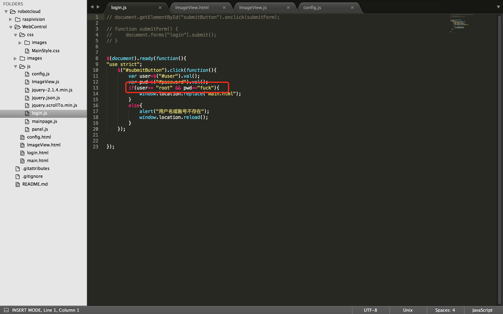
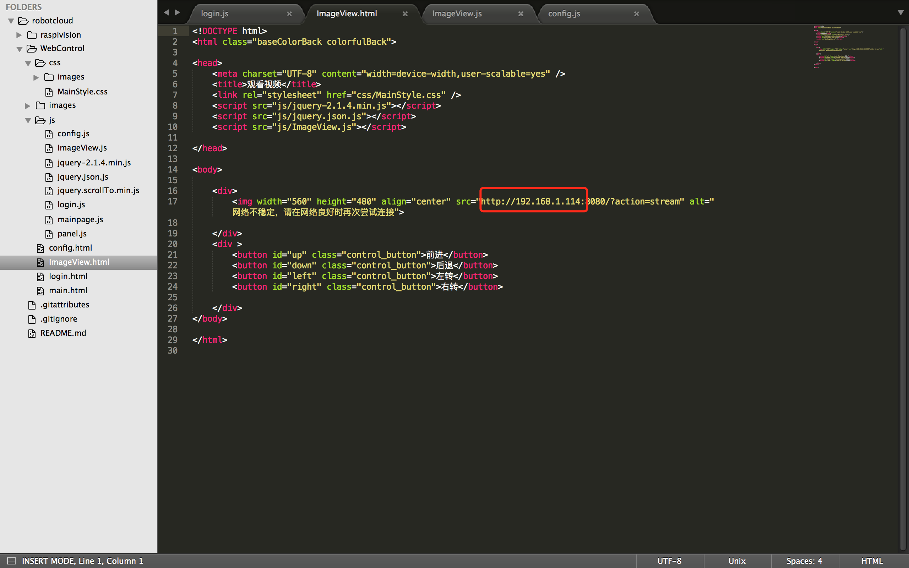
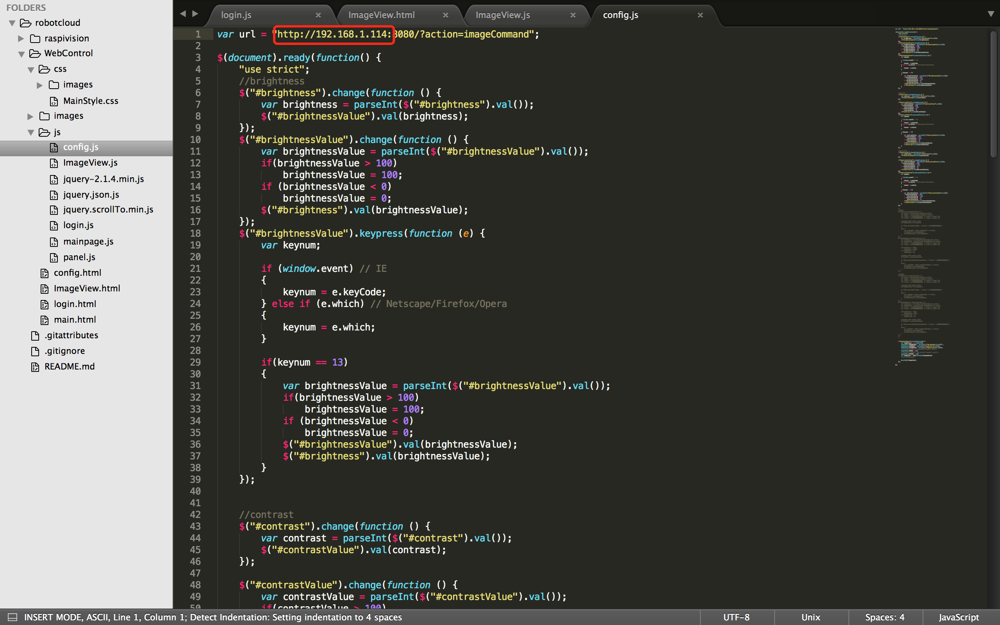
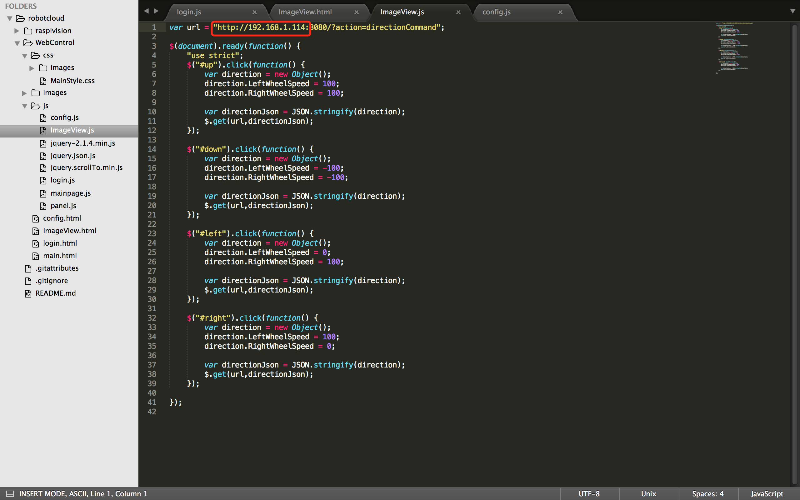

# robotcloud
基于树莓派和OpenCV的智能车，可以实现在局域网下在网页上查看智能车拍摄的视频，以及控制智能车的行为。

## raspivision简介

raspivision运行在树莓派`官方操作系统`raspberry上。
树莓派依赖库有`opencv`,`wiringPi`,`jsoncpp`

> opencv安装方式： 
> 
> 命令行安装

```bash
sudo apt-get install libopencv-dev
```

>wiringPi安装方式:	
>
>源码安装

wiringPi官网链接：[http://wiringpi.com](http://wiringpi.com)

>jsoncpp 安装方式： 
>
>将`根目录/`下的libjsoncpp.a拷贝至系统的静态链接库中

##  WebControl简介

### 登陆

webControl基于jquery，`登陆界面`为login.html。初始登陆账号为`root`，密码为`fuck`。

### 修改登录账号密码

如想更改账号和密码，请改动下图中标红部分,文件路径/webControl/js/login.js


### 修改局域网Ip地址
如果需要在自己的局域网中控制智能车，因为`局域网中IP地址会发生改变`，你需要根据自己的情况改动3处下图所标红的区域所示的IP地址

第1处：ImageView.html文件，路径为/webControl/ImageView.html



第2处：config.js文件,路径为/webControl/js/config.js


第3处：ImageView.js文件,路径为/webControl/js/ImageView.js


## 联系作者

如果对该项目有兴趣或者想进一步探讨该项目，可以联系邮箱[wanghan0501@vip.qq.com](wanghan0501@vip.qq.com)
